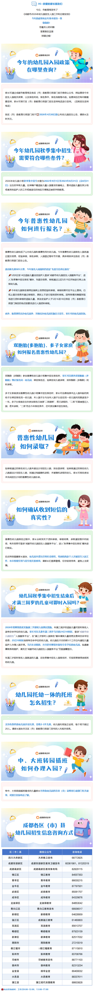

# 你关心的来啦！2026年成都市幼儿园招生入园政策解读

> **发布单位**：成都市教育局  
> **发布时间**：2026年4月16日  
> **时效性**：🟢 2026年最新政策  
> **来源等级**：S级（官方图解）  
> **原始图解**：见下方或访问 [原图链接](https://edu.chengdu.gov.cn/cdedu/c131243/2026-04/16/8e5d37b45106407ea6633ac1424f771f/images/80c810f7568a4d8fa31ff627f8b97afb.png)

---

## 一、今年的幼儿园入园政策在哪里查询？

- 登录"成都市幼儿园招生入园服务平台"进行查询
- 平台网址：https://xqj.cdeduypt.cn/

---

## 二、今年幼儿园秋季集中招生需要注意哪些事项？

### 招生对象
- **小班**：2022年9月1日至2023年8月31日（含8月31日）出生的适龄儿童
- **托班**：支持有条件的幼儿园开设托班，招收2-3岁儿童
- **满三岁即时入园**：支持年满三周岁的适龄儿童即时入读有空余学位的幼儿园

### 招生流程

| 步骤 | 时间 | 内容 |
|:---|:---|:---|
| 查看招生公告 | 4月30日前 | 各区(市)县教育行政部门发布普惠性幼儿园招生公告 |
| 网上信息采集 | 5月8日-14日 | 登录平台"秋季集中招生报名"模块提交基础信息 |
| 查看审核结果 | 信息提交后 | 实行联网校验及审核，监护人及时查看结果 |
| 现场资料审核 | 5月16日-18日 | 特殊情况需现场审核的到指定地点进行 |
| 报名及录取 | 5月19日-6月26日 | 通过审核的登录平台选报幼儿园，查看录取结果 |
| 入园登记 | 6月30日前 | 根据录取通知办理入园登记手续 |

---

## 三、今年普惠性幼儿园如何进行报名？

1. **网上信息采集**：5月8日-14日登录平台提交基础信息
2. **查看审核结果**：实行联网校验，及时查看
3. **选报幼儿园**：5月19日起登录平台选报
4. **查看录取结果**：及时关注录取通知

---

## 四、双胞胎(多胞胎)、多子女家庭如何报名普惠性幼儿园？

- **双胞胎(多胞胎)**：家长可**自愿选择**绑定报名同一幼儿园
- **多子女家庭**：家长可**自愿选择**未达入园年龄的其他子女与当年入园子女**绑定报名同一幼儿园**
- 未入园子女与当年入园子女应在同一幼儿园**共同就读至少一年**

---

## 五、普惠性幼儿园如何录取？

- 实行**联网校验及审核**
- 已通过线上审核的原则上不进行现场资料审核
- 因特殊情况确需现场审核的，到区(市)县教育行政部门指定地点进行入园资料审核

---

## 六、如何确认收到短信信息的真实性？

- 通过官方平台查询验证
- 关注"成都教育发布"等官方微信公众号获取权威信息

---

## 七、幼儿园秋季集中招生结束后还能上幼儿园吗？

- **满三岁即时入园**：支持年满三周岁的适龄儿童即时入读有空余学位的幼儿园
- 每月24日上午10:00起登录平台关注空余学位信息
- 每月25日10:00至该月最后一天17:00选报有空余学位的幼儿园
- 报名时间为**非寒暑假期间**

---

## 八、幼儿园托班一体的托班怎么报名？

- 支持有条件的幼儿园开设托班
- 招收2-3岁儿童
- 具体报名事宜咨询意向幼儿园

---

## 九、中、大班转园插班如何办理入园？

- 关注各幼儿园发布的空余学位信息
- 直接咨询意向幼儿园
- 根据幼儿园要求办理相关手续

---

## 十、成都各区(市)县幼儿园招生信息查询方式

| 区(市)县 | 查询方式 |
|:---|:---|
| 成都高新区 | 成都高新区官方网站/微信公众号 |
| 锦江区 | 锦江区教育局官方网站/微信公众号 |
| 青羊区 | 青羊区教育局官方网站/微信公众号 |
| 金牛区 | 金牛区教育局官方网站/微信公众号 |
| 武侯区 | 武侯区教育局官方网站/微信公众号 |
| 成华区 | 成华区教育局官方网站/微信公众号 |
| 龙泉驿区 | 龙泉驿区教育局官方网站/微信公众号 |
| 青白江区 | 青白江区教育局官方网站/微信公众号 |
| 新都区 | 新都区教育局官方网站/微信公众号 |
| 温江区 | 温江区教育局官方网站/微信公众号 |
| 双流区 | 双流区教育局官方网站/微信公众号 |
| 郫都区 | 郫都区教育局官方网站/微信公众号 |
| 新津区 | 新津区教育局官方网站/微信公众号 |
| 简阳市 | 简阳市教育局官方网站/微信公众号 |
| 都江堰市 | 都江堰市教育局官方网站/微信公众号 |
| 彭州市 | 彭州市教育局官方网站/微信公众号 |
| 邛崃市 | 邛崃市教育局官方网站/微信公众号 |
| 崇州市 | 崇州市教育局官方网站/微信公众号 |
| 金堂县 | 金堂县教育局官方网站/微信公众号 |
| 大邑县 | 大邑县教育局官方网站/微信公众号 |
| 蒲江县 | 蒲江县教育局官方网站/微信公众号 |
| 成都东部新区 | 东部新区官方网站/微信公众号 |
| 四川天府新区 | 天府新区官方网站/微信公众号 |

---

## 原始图解

---

*信息来源：成都市教育局官网《你关心的来啦！2026年成都市幼儿园招生入园政策解读》*  
*数据采集：DrissionPage + 瑞数cookie预热方案（2026-05-01）*  
*整理时间：2026-05-01*

## 来源说明

- [S] 你关心的来啦！2026年成都市幼儿园招生入园政策解读 — https://edu.chengdu.gov.cn/cdedu/c131243/2026-04/16/content_8e5d37b45106407ea6633ac1424f771f.shtml
